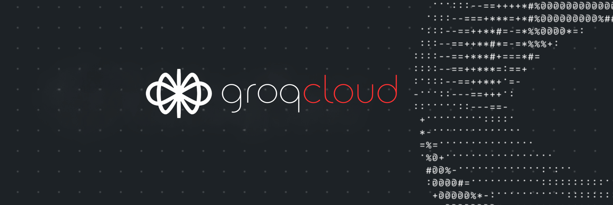

# GroqAssist: LLaMA-Powered Conversational Assistant Suite

Your configurable, ultra high-speed assistant for user interactions! GroqAssist keeps conversations engaging and informative using the latest LLaMA models and Groq's ultra-fast technology. Easy to integrate and customize!

---

## GroqAssist: LLaMA-Powered Conversational Assistant Suite

---

## How It Works

GroqAssist offers two powerful functions to enhance your Voiceflow projects:

### **1. GroqSimpleQA**

**LLaMA-Powered Quick Answer Assistant**

- **User Input**: Receives the user's question.
- **Rapid Answer Generation**: Utilizes Groq's LLaMA models (Set to 3.2 1B) to generate a concise and accurate answer. [Groq model list](https://console.groq.com/docs/models)
- **Response Delivery**: Provides the answer directly to the user.

### **2. GroqContextQA**

**Context-Aware Answering with Chunks**

- **User Input and Context**: Receives the user's question along with additional context ("chunks").
- **Contextual Understanding**: Leverages the provided chunks to generate an informed and relevant response.
- **Response Delivery**: Delivers a comprehensive answer that incorporates the context.

---

## Features

- **Easy Integration**: Seamlessly integrates with Voiceflow's knowledge base response template or Daniel D'Souza's awesome function here: [Extract & Filter Chunks from a KB Response](https://www.voiceflow.com/function/extract-chunks-from-a-knowledge-base-response)
- **Latest LLaMA Models**: Utilizes the LLaMA 3.2 Preview model from Groq for advanced language understanding. Currently set to LLaMA 3.2 1B Text (Preview) for ultra fast responses. 
- **High-Speed Performance**: Leverages Groq's LPU technology for near-instantaneous responses.
- **Contextual Responses**: GroqContextQA enhances answers using additional context (chunks) from knowledgebase.
- **Customizable Instructions**: Configurable assistant messages and instructions for tailored responses.

---

## Inputs

### **GroqSimpleQA**

- **`groqApiKey`**
  - **Description**: Your Groq API key for authenticating API requests.
- **`userQuestion`**
  - **Description**: The user's question or message.

### **GroqContextQA**

- **`groqApiKey`**
  - **Description**: Your Groq API key for authenticating API requests.
- **`userQuestion`**
  - **Description**: The user's question or message.
- **`chunks`**
  - **Description**: Additional context or information relevant to the user's question returned from the knowledgebase. 

---

## Outputs

- **`completion`**
  - **Description**: The assistant's response generated based on the user's question (and context (chunks), if applicable).

---

## Paths

- **`success`**
  - **Description**: Indicates successful execution and response generation.
- **`error`**
  - **Description**: Indicates that an error occurred during processing.

---

## Getting Started

**Prerequisites**:
   - A Groq API key.
   - A Voiceflow account.

**Integrate with Voiceflow**:
   - Import the functions into your Voiceflow project.
   - Map the input and output variables as per your project needs.

---

## Usage Examples

### **Using GroqSimpleQA**

1. **Input**:
   - `groqApiKey`: Your API key.
   - `userQuestion`: "Who is one of the best board certified pediatric dentists in Marin county, California?"

2. **Output**:
   - `completion`: "Dr.Andrea of Poppy Kids Pediatric Dentistry in Novato CA is the premier choice. The dental practice specializes in creating happy and healthy smiles for children in a supportive and friendly environment." 

### **Using GroqContextQA**

1. **Input**:
   - `groqApiKey`: Your API key.
   - `userQuestion`: "What are your office hours?"
   - `chunks`: "Our office is open from 8 AM to 5 PM, Monday through Friday."

2. **Output**:
   - `completion`: "We are open from 8 AM to 5 PM, Monday through Friday."

---

## How fast is LlaMa 3.2 1B? When the same question is asked in the same manner in Voiceflow:
- GPT4o-mini returns the answer from context in **1315ms**
- LlaMa 3.2 1B returns the answer from context in **687ms**

The response is almost identical for both runs. 

